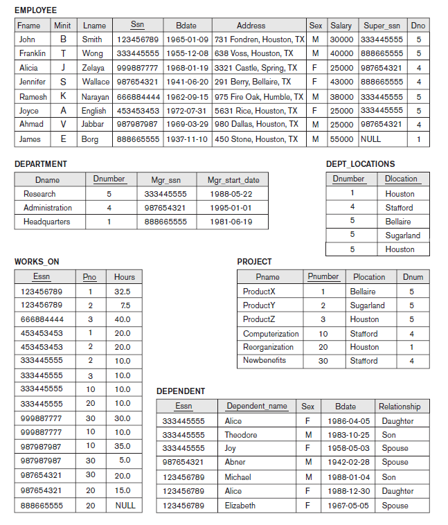

### Queries
1. Print first name and social security no. of all employees  
1. Print full name of all female employees
1. Print social security no. of all employees who worked in research department
1. Print salary of all male employees whose salary is less than 30000 and worked in Administration department
1. Print all department names of HustonPrint manager names of all employees
1. Print max salary and department name department wise
1. Count how many employees are working in each department location 
1. List all those employees whose salary is less the ‘Franklin’ salary
1. Find the youngest employee in every department
